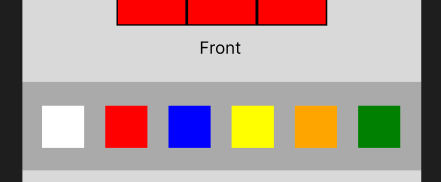

This is a document that will be written as I create this project. Won't be too descriptive but more just an outline so I and whoever reads this can see my progress. Hope you enjoy!

To start off I'm going to imagine what I would want the site to look like and in what way I am going to code it.

I had grand aspirations but decided it may be better to get working and first just get a simple page running and looking right with react. But this is what I was aiming for:

I am going to use Vite, this is a lightweight web server that allows me to run the application. After setting that up to quickly get done the nav bar I will use my Navbar.jsx that I created in a prior project. Downloaded the neccesary additions too. I concluded that the text could just be added and then styles with CSS later so decided to focus on the rubix cube component first.

Rather than have it click it and have it rotate I decided it would be better to have something yoou select and then are ablle to fill it in with different colours after.

After getting some basic code written the site looks like this.

From here 

Needed Contexts to work:
- Colour of selector
- Side of cube 
- Array with sides stored